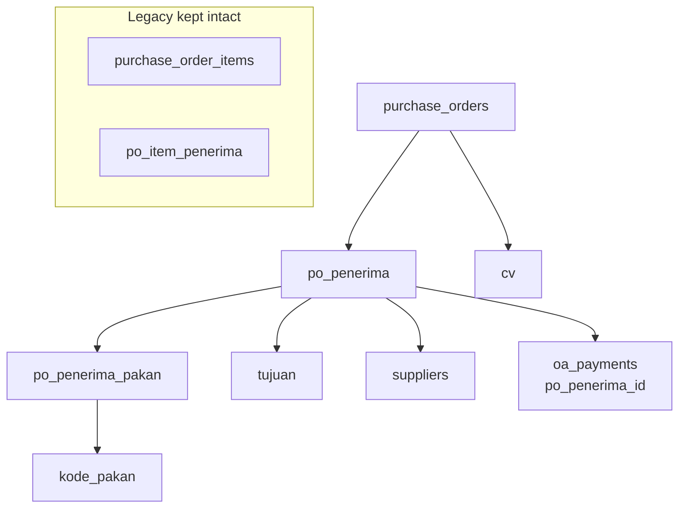
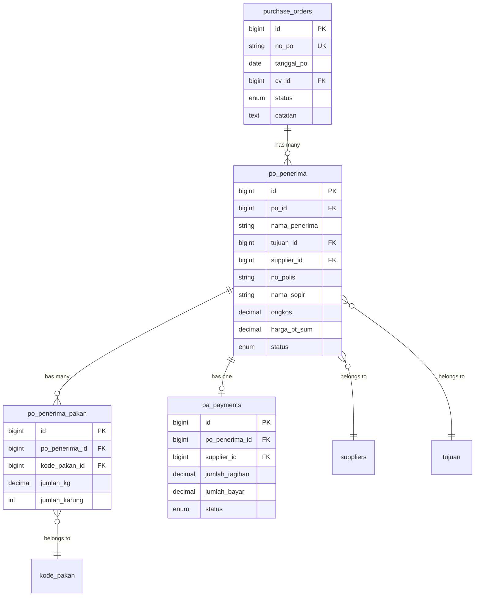

# Design Document: PO Penerima Multi-Pakan

## Overview

Fitur ini merombak struktur data Purchase Order (PO) dari model lama berbasis kendaraan
(`purchase_order_items` = satu baris per mobil) menjadi model baru berbasis penerima
(`po_penerima` = satu baris per peternak). Setiap penerima dapat memiliki beberapa kode pakan
(`po_penerima_pakan`), dan satu mobil (no_polisi) bisa mengangkut untuk banyak penerima sekaligus.

Perubahan utama:
- `supplier_id` berada di level `po_penerima` (per mobil/penerima), bukan di PO header
- Tabel `po_penerima` menggantikan `purchase_order_items` sebagai baris utama PO
- Tabel `po_penerima_pakan` menyimpan detail kode pakan per penerima
- Dua harga terpisah: `ongkos` (ke supplier/OA) dan `harga_pt_sum` (ke PT SUM)
- Tabel lama dipertahankan untuk backward compatibility

---

## Architecture



### Layer Stack

```
Routes (web.php)
  └── PurchaseOrderController   — CRUD PO + penerima
  └── RekapPoController         — rekap OA supplier + rekap PT SUM
  └── RekapOaController         — (updated) bayar OA per penerima

Models
  └── PurchaseOrder             — + penerimas()
  └── PoPenerima                — baris penerima per PO
  └── PoPenerimaPakan           — detail kode pakan per penerima

Exports
  └── PurchaseOrderExport       — refactored: dynamic kode pakan columns
  └── RekapPoExport             — new: dua sheet OA + PT SUM

Commands
  └── MigratePoStrukturCommand  — artisan po:migrate-struktur [--dry-run]
```

---

## Components and Interfaces

### Models

#### `PurchaseOrder` (updated)

```php
// app/Models/PurchaseOrder.php
protected $fillable = [
    'no_po', 'tanggal_po', 'cv_id', 'status', 'catatan'
];

// Relations
public function penerimas(): HasMany    // → PoPenerima
// existing: cv(), items(), lansirPayments() — unchanged
```

#### `PoPenerima` (new)

```php
// app/Models/PoPenerima.php
protected $table = 'po_penerima';
protected $fillable = [
    'po_id', 'nama_penerima', 'tujuan_id', 'supplier_id', 'no_polisi', 'nama_sopir',
    'ongkos', 'harga_pt_sum', 'status'
];
protected $casts = ['ongkos' => 'decimal:2', 'harga_pt_sum' => 'decimal:2'];

const STATUSES = ['pending', 'berangkat', 'selesai', 'batal'];
const VALID_TRANSITIONS = [
    'pending'   => ['berangkat', 'batal'],
    'berangkat' => ['selesai', 'batal'],
    'selesai'   => [],
    'batal'     => [],
];

// Relations
public function po(): BelongsTo
public function tujuan(): BelongsTo
public function supplier(): BelongsTo   // → Supplier
public function pakans(): HasMany       // → PoPenerimaPakan
public function oaPayment(): HasOne     // → OaPayment (via po_penerima_id)

// Computed attributes
public function getTotalKgAttribute(): float    // sum of pakans.jumlah_kg
public function getTotalOaAttribute(): float    // total_kg × ongkos
public function getTotalPtSumAttribute(): float // total_kg × harga_pt_sum
```

#### `PoPenerimaPakan` (new)

```php
// app/Models/PoPenerimaPakan.php
protected $table = 'po_penerima_pakan';
protected $fillable = [
    'po_penerima_id', 'kode_pakan_id', 'jumlah_kg', 'jumlah_karung'
];

// Relations
public function penerima(): BelongsTo   // → PoPenerima
public function kodePakan(): BelongsTo  // → KodePakan

// Boot: auto-calculate jumlah_karung = ceil(jumlah_kg / 50)
protected static function booted(): void
{
    static::saving(function ($model) {
        $model->jumlah_karung = (int) ceil($model->jumlah_kg / 50);
    });
}
```

### Controllers

#### `PurchaseOrderController` (refactored)

| Method | Route | Description |
|--------|-------|-------------|
| `index` | GET /purchase-order | DataTables list |
| `create` | GET /purchase-order/create | Form with dynamic penerima rows (supplier_id per penerima) |
| `store` | POST /purchase-order | Validate + create PO + penerimas + pakans in transaction |
| `show` | GET /purchase-order/{id} | Detail: penerima table + per-mobil summary |
| `edit` | GET /purchase-order/{id}/edit | Edit form (draft only) |
| `update` | PUT /purchase-order/{id} | Sync penerimas + pakans |
| `destroy` | DELETE /purchase-order/{id} | Delete draft PO |
| `lock` | POST /purchase-order/{id}/lock | Lock if all penerima selesai/batal |
| `unlock` | POST /purchase-order/{id}/unlock | Unlock to draft |
| `exportPo` | GET /purchase-order/{id}/export | Excel export (new format) |

#### `RekapPoController` (new)

| Method | Route | Description |
|--------|-------|-------------|
| `show` | GET /purchase-order/{id}/rekap-po | Rekap OA supplier + rekap PT SUM |
| `export` | GET /purchase-order/{id}/rekap-po/export | Excel: 2 sheets |

#### `RekapOaController` (updated)

- `bayar()` dan `storeBayar()` diupdate untuk menggunakan `po_penerima_id` sebagai referensi
- Query diupdate dari `PurchaseOrderItem` ke `PoPenerima`

### Artisan Command

```php
// app/Console/Commands/MigratePoStrukturCommand.php
// Signature: po:migrate-struktur {--dry-run}
```

---

## Data Models

### Database Schema

#### Migration 1: Create `po_penerima`

```sql
CREATE TABLE po_penerima (
    id              BIGINT UNSIGNED AUTO_INCREMENT PRIMARY KEY,
    po_id           BIGINT UNSIGNED NOT NULL REFERENCES purchase_orders(id) ON DELETE CASCADE,
    nama_penerima   VARCHAR(255) NOT NULL,
    tujuan_id       BIGINT UNSIGNED NULL REFERENCES tujuan(id) ON DELETE SET NULL,
    supplier_id     BIGINT UNSIGNED NULL REFERENCES suppliers(id) ON DELETE SET NULL,
    no_polisi       VARCHAR(20) NOT NULL,
    nama_sopir      VARCHAR(255) NULL,
    ongkos          DECIMAL(15,2) NOT NULL DEFAULT 0 COMMENT 'Rp/kg ke supplier',
    harga_pt_sum    DECIMAL(15,2) NOT NULL DEFAULT 0 COMMENT 'Rp/kg ke PT SUM',
    status          ENUM('pending','berangkat','selesai','batal') NOT NULL DEFAULT 'pending',
    created_at      TIMESTAMP NULL,
    updated_at      TIMESTAMP NULL
);
```

#### Migration 2: Create `po_penerima_pakan`

```sql
CREATE TABLE po_penerima_pakan (
    id              BIGINT UNSIGNED AUTO_INCREMENT PRIMARY KEY,
    po_penerima_id  BIGINT UNSIGNED NOT NULL REFERENCES po_penerima(id) ON DELETE CASCADE,
    kode_pakan_id   BIGINT UNSIGNED NOT NULL REFERENCES kode_pakan(id) ON DELETE RESTRICT,
    jumlah_kg       DECIMAL(10,2) NOT NULL,
    jumlah_karung   INT NOT NULL COMMENT 'ceil(jumlah_kg / 50)',
    created_at      TIMESTAMP NULL,
    updated_at      TIMESTAMP NULL,
    UNIQUE KEY uq_penerima_pakan (po_penerima_id, kode_pakan_id)
);
```

#### Migration 3: Update `oa_payments`

```sql
ALTER TABLE oa_payments
    ADD COLUMN po_penerima_id BIGINT UNSIGNED NULL
        REFERENCES po_penerima(id) ON DELETE SET NULL;
-- po_item_id dipertahankan untuk backward compatibility
```

### Entity Relationship Diagram



### Data Flow: Store PO

```
POST /purchase-order
  ├── Validate header (no_po, tanggal_po, cv_id)
  ├── Validate penerima[] array (min 1)
  │   └── Each penerima: nama_penerima, tujuan_id, supplier_id, no_polisi, ongkos, harga_pt_sum
  │       └── pakans[] (min 1): kode_pakan_id, jumlah_kg > 0
  │           └── Unique kode_pakan_id per penerima
  ├── DB::transaction()
  │   ├── PurchaseOrder::create(header)
  │   ├── foreach penerima:
  │   │   ├── PoPenerima::create(penerima_data + supplier_id, status='pending')
  │   │   └── foreach pakan:
  │   │       └── PoPenerimaPakan::create(pakan_data)
  │   │           └── auto: jumlah_karung = ceil(jumlah_kg / 50)
  │   └── commit
  └── redirect to edit with success
```

### Data Flow: Migration Command

```
php artisan po:migrate-struktur [--dry-run]
  ├── For each purchase_order_items:
  │   ├── INSERT po_penerima (map fields: po_id, nama_penerima, tujuan_id, ongkos,
  │   │       no_polisi, nama_supir→nama_sopir, status, supplier_id from item)
  │   └── If kode_pakan_id NOT NULL AND berat NOT NULL:
  │       └── INSERT po_penerima_pakan (berat→jumlah_kg, recalc karung)
  ├── For each oa_payments with po_item_id:
  │   └── UPDATE oa_payments SET po_penerima_id = (matching new id)
  └── Verify: sum(po_penerima_pakan.jumlah_kg) == sum(items.berat where kode_pakan_id not null)
      └── Log result
```

---

## Views

### `create.blade.php` — Form Buat PO Baru

**Layout:**
```
[Header PO]
  - No. PO | Tanggal PO | CV | Catatan

[Daftar Penerima]  ← dynamic rows via JS
  ┌─────────────────────────────────────────────────────────────┐
  │ #1  Nama Penerima | Tujuan | Supplier | No. Polisi | Nama Sopir │
  │     Ongkos (Rp/kg) | Harga PT SUM (Rp/kg)                  │
  │     [Kode Pakan]                                            │
  │       ┌──────────────────────────────────────┐             │
  │       │ Kode Pakan | Jumlah (kg) | Karung    │             │
  │       │ [+ Tambah Pakan]                     │             │
  │       └──────────────────────────────────────┘             │
  │     [Hapus Penerima]                                        │
  └─────────────────────────────────────────────────────────────┘
  [+ Tambah Penerima]

[Simpan PO]
```

**JS Behavior:**
- `+ Tambah Penerima` → clone template penerima row, update index
- `+ Tambah Pakan` → clone template pakan row dalam penerima tersebut
- `jumlah_kg` input → auto-update `jumlah_karung` = `Math.ceil(kg / 50)`
- Validasi client-side: minimal 1 penerima, minimal 1 pakan per penerima

### `edit.blade.php` — Form Edit PO

Struktur identik dengan `create.blade.php`, dengan tambahan:
- Tampilkan badge status per penerima
- Dropdown status per penerima (pending/berangkat/batal — sesuai transisi valid)
- Lock/Unlock button di header
- Jika PO locked: semua field readonly, tampilkan alert

### `show.blade.php` — Detail PO

**Layout:**
```
[Header PO]
  No. PO | Tanggal | CV | Status | Catatan

[Tabel Penerima]
  Kolom: # | Nama Penerima | Tujuan | Supplier | [Kode Pakan cols...] | Plat | Sopir
         | Ongkos/kg | Harga PT SUM/kg | Total KG | Total OA | Total PT SUM | Status

[Ringkasan Per Mobil]
  Kolom: No. Polisi | Penerima | Total KG

[Tombol: Export Excel | Rekap PO]
```

Kode pakan ditampilkan sebagai kolom dinamis (pivot): setiap kode pakan yang ada di PO
menjadi satu kolom, nilai = jumlah_karung penerima tersebut untuk kode pakan itu.

### `rekap-po/show.blade.php` — Rekap OA + PT SUM

**Layout:**
```
[Rekap Supplier (OA)]
  Tabel: # | Nama Penerima | Total KG | Ongkos/kg | Total OA | Status Bayar

  Grand Total OA: Rp xxx

[Rekap PT SUM]
  Tabel: # | Nama Penerima | Total KG | Harga PT SUM/kg | Total PT SUM

  Grand Total PT SUM: Rp xxx

[Tombol: Export Excel]
```

---

## Correctness Properties

*A property is a characteristic or behavior that should hold true across all valid executions of a system — essentially, a formal statement about what the system should do. Properties serve as the bridge between human-readable specifications and machine-verifiable correctness guarantees.*

### Property 1: Jumlah karung selalu ceil(jumlah_kg / 50)

*For any* positive value of `jumlah_kg`, the stored `jumlah_karung` SHALL equal `ceil(jumlah_kg / 50)`.

**Validates: Requirements 1.5**

---

### Property 2: PoPenerimaPakan round-trip

*For any* valid `PoPenerimaPakan` record (with valid `po_penerima_id`, `kode_pakan_id`, and `jumlah_kg > 0`), saving and reloading from the database SHALL produce a record with identical field values.

**Validates: Requirements 1.4**

---

### Property 3: Duplikat kode pakan per penerima ditolak

*For any* `po_penerima_id` and `kode_pakan_id`, attempting to insert a second `po_penerima_pakan` record with the same `(po_penerima_id, kode_pakan_id)` pair SHALL result in a database or validation error.

**Validates: Requirements 1.7**

---

### Property 4: Total KG adalah jumlah seluruh jumlah_kg pakan

*For any* `PoPenerima` with any number of `PoPenerimaPakan` rows, `total_kg` SHALL equal the arithmetic sum of all `jumlah_kg` values in those rows.

**Validates: Requirements 3.1**

---

### Property 5: Total OA dan Total PT SUM dihitung independen per penerima

*For any* `PoPenerima` with `total_kg`, `ongkos`, and `harga_pt_sum`, `total_oa` SHALL equal `total_kg × ongkos` and `total_pt_sum` SHALL equal `total_kg × harga_pt_sum`, independently of any other penerima in the same PO.

**Validates: Requirements 3.2, 3.3, 3.5**

---

### Property 6: Grand total adalah jumlah total per penerima

*For any* PO with any number of penerima, the grand total OA SHALL equal the sum of `total_oa` across all penerima, and the grand total PT SUM SHALL equal the sum of `total_pt_sum` across all penerima.

**Validates: Requirements 3.4, 9.5**

---

### Property 7: Status awal penerima selalu pending

*For any* newly created `PoPenerima`, the initial `status` SHALL be `pending`.

**Validates: Requirements 4.1**

---

### Property 8: Transisi status mengikuti alur yang valid

*For any* `PoPenerima` with a given `status`, attempting a transition to a status not in `VALID_TRANSITIONS[current_status]` SHALL be rejected. Conversely, any transition within the allowed set SHALL succeed.

**Validates: Requirements 4.2, 4.3**

---

### Property 9: Penguncian PO hanya diizinkan jika semua penerima terminal

*For any* PO, `canLock()` SHALL return `true` if and only if every `PoPenerima` has status `selesai` or `batal`. If any penerima has status `pending` or `berangkat`, `canLock()` SHALL return `false`.

**Validates: Requirements 4.4, 4.5**

---

### Property 10: Cascade delete penerima menghapus semua pakan terkait

*For any* `PoPenerima` with any number of `PoPenerimaPakan` rows, deleting the `PoPenerima` SHALL result in all associated `PoPenerimaPakan` rows being deleted.

**Validates: Requirements 2.7**

---

### Property 11: Migrasi mempertahankan total kg

*For any* set of `purchase_order_items` records with non-null `kode_pakan_id` and `berat`, after running `po:migrate-struktur`, the sum of `po_penerima_pakan.jumlah_kg` SHALL equal the sum of `purchase_order_items.berat` for those qualifying records.

**Validates: Requirements 6.4**

---

### Property 12: Ekspor Excel memiliki kolom dinamis sesuai kode pakan dalam PO

*For any* PO with N distinct `kode_pakan_id` values across its penerima, the exported Excel file SHALL contain exactly N + 4 data columns (NO, PETERNAK, [N kode pakan cols], PLAT, KETERANGAN), and the subtotal row SHALL equal the column-wise sum of all data rows.

**Validates: Requirements 8.1, 8.3**

---

### Property 13: Urutan baris ekspor berdasarkan no_polisi

*For any* PO export, the rows SHALL be sorted in ascending order by `no_polisi`, such that all penerima sharing the same `no_polisi` appear consecutively.

**Validates: Requirements 8.2**

---

## Error Handling

### Validation Errors (HTTP 422 / redirect back with errors)

| Scenario | Error |
|----------|-------|
| `no_po` kosong atau sudah ada | `no_po` required / unique |
| `supplier_id` tidak ada di DB (per penerima) | `penerima.*.supplier_id` exists |
| Tidak ada penerima | `penerima` min:1 |
| Penerima tanpa kode pakan | `penerima.*.pakans` min:1 |
| `jumlah_kg` ≤ 0 | `jumlah_kg` min:0.01 |
| Duplikat kode pakan per penerima | Validation error: kode pakan duplikat |
| Transisi status tidak valid | Error: transisi tidak diizinkan |
| Update PO locked | Error: PO sudah dikunci |
| Lock PO dengan penerima pending/berangkat | Error: masih ada N penerima belum selesai |

### Database Errors

- Unique constraint violation pada `(po_penerima_id, kode_pakan_id)` → caught dan dikonversi ke validation error
- Foreign key violation → caught dan dikembalikan sebagai user-friendly error

### Migration Command Errors

- Record dengan data tidak lengkap → di-skip dan dicatat di log
- Verifikasi total kg gagal → dicatat sebagai warning di log, tidak rollback

---

## Testing Strategy

### Unit Tests (PHPUnit)

Fokus pada logika bisnis yang spesifik:

- `PoPenerima::getTotalKgAttribute()` — contoh konkret dengan 2-3 pakan
- `PoPenerima::getTotalOaAttribute()` — contoh dengan nilai ongkos tertentu
- `PurchaseOrder::canLock()` — contoh: semua selesai, ada yang pending
- Status transition validation — contoh per transisi valid/invalid
- `MigratePoStrukturCommand` dengan `--dry-run` — tidak mengubah data

### Property-Based Tests (PestPHP + `spatie/pest-plugin-test-time` atau `eris/eris`)

Library yang digunakan: **`eris/eris`** (PHP property-based testing library).
Setiap property test dikonfigurasi minimum **100 iterasi**.

Tag format: `Feature: po-penerima-multi-pakan, Property {N}: {property_text}`

```php
// Contoh struktur property test
use Eris\TestTrait;

class PoPenerimaPakanPropertyTest extends TestCase
{
    use TestTrait;

    /**
     * Feature: po-penerima-multi-pakan, Property 1: jumlah_karung = ceil(jumlah_kg / 50)
     */
    public function test_jumlah_karung_is_ceil_of_kg_divided_by_50(): void
    {
        $this->forAll(
            Generator\float(0.01, 100000.0)
        )->then(function (float $kg) {
            $pakan = PoPenerimaPakan::factory()->make(['jumlah_kg' => $kg]);
            $this->assertEquals((int) ceil($kg / 50), $pakan->jumlah_karung);
        });
    }
}
```

Setiap property dari bagian Correctness Properties diimplementasikan sebagai satu property test.

### Integration Tests

- DataTables filter PO (no_po, tanggal, supplier, status) — 2-3 kombinasi filter
- Export Excel menghasilkan file yang dapat diunduh
- Rekap OA: grouping per penerima menghasilkan nilai yang benar
- Artisan command `po:migrate-struktur` pada data sampel

### Smoke Tests

- Tabel `po_penerima` dan `po_penerima_pakan` ada setelah migration
- Artisan command `po:migrate-struktur --dry-run` berjalan tanpa error
- Export Excel menggunakan Maatwebsite Excel tanpa exception
